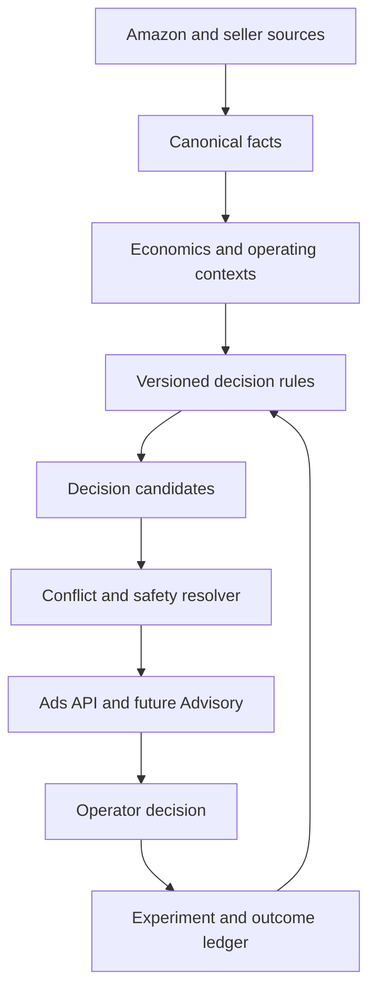

# Advertising V2 decision and capital-allocation system

**Status:** Design source of truth. Implementation is not authorized by this document alone.  
**Controller:** [#449](https://github.com/PacoCotera/dpp-analytics/issues/449)  
**Date:** 2026-09-03  
**Supersedes:** the product ambition and information architecture in [#414](https://github.com/PacoCotera/dpp-analytics/issues/414), not its completed ingestion, reconciliation, state-management, URL-state, or QA foundations  
**Related:** [#22](https://github.com/PacoCotera/dpp-analytics/issues/22), [#277](https://github.com/PacoCotera/dpp-analytics/issues/277), [#439](https://github.com/PacoCotera/dpp-analytics/issues/439), [#445](https://github.com/PacoCotera/dpp-analytics/issues/445)

## 1. Executive decision

Advertising V2 is not a reporting redesign. It is DPP's advertising decision and capital-allocation system.

The current Advertising product is accurate and appropriately cautious, but it remains an observability layer. It
reports spend, traffic, Amazon-attributed performance, seller-sales cost load, Search Query Performance gaps, and
basic review candidates. Its server contract explicitly declares product economics unavailable and prohibits
profitability, scaling, spend-reduction, and bid claims. Most outputs therefore stop at "review this."

V2 must answer a harder operating question:

> Where should the next advertising peso go, what should stop receiving money, what other business constraint
> changes that decision, and how will DPP verify the result?

The product will combine reconciled economics, paid-response evidence, Amazon-wide search demand, product and
catalog identity, inventory, and recorded outcomes. It will preserve the distinction between observed facts,
Amazon attribution, scenarios, forecasts, and causal evidence.

The browser will not own business logic. PostgreSQL, Python domain services, named rules, and explicit contracts
will own facts, joins, formulas, eligibility, materiality, confidence, ranking, suppression, and recommendations.
The browser will render those contracts, manage accessible interaction, and preserve URL state.

## 2. Why the current product is insufficient

Advertising V1 solved genuine foundation problems:

- Amazon Ads connection, backfill, refresh, coverage, quality, and attribution-maturity states are explicit.
- Campaign, advertised-product, target, and search-term reports are persisted at their source grains.
- Product advertising facts are joined to independently reconciled seller sales.
- Brand Analytics Search Query Performance is ingested for canonical current ASINs.
- Search opportunities diagnose visibility, click, cart, and purchase-stage gaps without claiming causality.
- Product identity is primary and raw Amazon identifiers are supporting evidence.
- Interpretations are server-owned, named, versioned, and maturity-aware.
- Cross-route Ads context uses one bounded server projection.
- CI and standalone browser acceptance protect connection states, URL state, accessibility, and layout.

Those foundations should be retained. The product model should not.

V1 still falls short because:

1. It leads with cost-load and attributed-performance measures rather than a decision.
2. Its recommendation vocabulary is intentionally weak because economic operands are incomplete.
3. It does not quantify business value at risk or opportunity in a common monetary basis.
4. It cannot distinguish observed contribution from attributed response or causal lift.
5. It has no durable record of decisions, changes, hypotheses, guardrails, or outcomes.
6. It does not estimate marginal response, so it cannot safely answer where the next peso should go.
7. Campaign, target, and term evidence remains too close to Amazon's report structure.
8. Cross-domain context is displayed, but not yet resolved into one coherent recommendation.
9. A technically valid output can still be unhelpful, repetitive, spatially wasteful, or cryptic.

V2 must not patch these deficiencies with more cards, charts, legends, tooltips, or client-side calculations.

## 3. Product charter

### 3.1 Primary user

The primary user is the DPP owner/operator making business and capital-allocation decisions, not a media analyst.

Specialist campaign and targeting evidence remains available for diagnosis and eventual execution, but it is not
the primary navigation or language model.

### 3.2 Jobs to be done

Within 15 seconds of opening Advertising, the operator must be able to identify:

1. whether an advertising decision is required;
2. the highest-value or highest-risk decision;
3. the exact product, query, target, or campaign affected;
4. the observed financial exposure or bounded scenario;
5. why the recommendation is eligible now;
6. which inventory, finance, product, or data-health condition changes the answer;
7. the proposed action and its guardrails;
8. how and when the outcome will be evaluated.

### 3.3 Product outcomes

V2 succeeds when it helps DPP:

- protect contribution from demonstrably unproductive or operationally unsafe spend;
- avoid paying to create demand that cannot be fulfilled;
- identify demand that merits a controlled, measurable advertising test;
- identify listing, price, shipping, or product-fit problems before changing media;
- allocate learning budgets explicitly rather than confusing them with proven returns;
- compare products on one reconciled economic and operational basis;
- learn from prior actions instead of rediscovering the same pattern every month;
- supply safe, structured decision objects to the future cross-domain Advisory module.

### 3.4 Non-goals for the first V2 release

- No autonomous bid, budget, campaign, listing, or inventory mutation.
- No profitability claim from ROAS, ACOS, TACOS, attributed sales, or relative rank alone.
- No incremental-sales claim from Amazon attribution.
- No exact paid/organic split from Search Query Performance or residual arithmetic.
- No opaque machine-learning score presented as business truth.
- No LLM-owned metric, threshold, trust state, recommendation eligibility, or execution decision.
- No generic alert center that repeats every domain's notifications.
- No raw Amazon report table as a primary workspace.
- No permanent `v2`, `new`, `enhance`, `override`, or compatibility source layer.
- No parallel browser renderers.
- No Ads-specific reimplementation of shared layout, chart, format, navigation, or accessibility primitives.

## 4. Design principles

### 4.1 Decisions first

The dominant surface is a bounded, ranked decision queue. Reports and charts exist only to explain or evaluate a
decision.

### 4.2 One business object, one owner

Every fact, window, state, interpretation, recommendation, and lifecycle transition has one canonical server
owner. A duplicated calculation is a defect even when both results currently match.

### 4.3 Separate truth classes

The product must never visually or semantically blur these classes:

| Truth class | Meaning | Examples | Allowed language |
| --- | --- | --- | --- |
| Observed fact | Reconciled source measurement | spend, net sales, fees, stock, clicks | `was`, `is`, `measured` |
| Amazon attribution | Amazon associates an event with advertising | attributed purchases and sales | `Amazon attributed` |
| Derived diagnostic | Deterministic interpretation of observed facts | funnel-stage gap, inventory conflict | `indicates`, `requires review` |
| Sensitivity scenario | Arithmetic result under explicit assumptions | 25% to 50% gap closure | `scenario`, `could mean if` |
| Forecast | Model estimate validated against held-out outcomes | expected purchases or contribution | `forecast`, with interval and version |
| Causal estimate | Result of an eligible controlled or quasi-experiment | measured effect after a change | `estimated effect`, with design and limitations |

UI labels, API types, exports, and Advisory prompts must preserve the class.

### 4.4 Financial materiality before media efficiency

The primary operating unit is MXN contribution or MXN exposure. ROAS, ACOS, TACOS, CTR, CPC, and conversion are
supporting diagnostics, not the decision by themselves.

### 4.5 Cross-domain constraints can override Ads evidence

Inventory shortage, unresolved economics, listing readiness, data quality, and Finance reconciliation may
suppress or change an advertising action. A strong paid-response signal is not permission to scale.

### 4.6 Uncertainty is a contract

Every recommendation exposes its evidence class, readiness, confidence basis, blockers, period, and expiration.
"Confidence" is deterministic evidence sufficiency, not an invented probability.

### 4.7 Learning is an operating output

A recommendation is incomplete unless it states how success or failure will be evaluated. Every approved test or
change enters the outcome ledger.

### 4.8 Empty space and repeated explanation are defects

Unavailable, healthy, and no-action states collapse to a compact state with the next valid action. Hidden or
absent content must consume no layout height. Core meaning must not depend on a tooltip.

## 5. Functional decision model

V2 organizes work into five operator questions:

| Lane | Question | Typical output |
| --- | --- | --- |
| Protect | Is current spend creating immediate financial or operational exposure? | cap, pause-review, replenish, repair data |
| Eliminate leakage | Which mature demand or product paths consume money without sufficient response? | negative-target, match-narrowing, listing-relevance review |
| Capture demand | Which observed marketplace or paid signals justify a bounded test? | exact-query test, product-support test, PDP intervention |
| Allocate | Which products have economic headroom and evidence for the next controlled peso? | budget reallocation experiment, not an unconditional scale claim |
| Learn | Did an approved intervention create the intended result? | continue, revert, extend, or conclude an experiment |

Each lane may be empty. Empty lanes are not rendered as empty containers.

## 6. Current capability inventory

### 6.1 Existing decision-grade or directionally useful inputs

| Domain/source | Current grain | Current value to V2 | Qualification |
| --- | --- | --- | --- |
| Amazon Ads account report | account, ad product, day | total spend and attributed response | attribution, not incrementality |
| Amazon Ads campaign report | campaign, day | campaign response and cost | no causal or profitability claim |
| Amazon Ads advertised product report | product/campaign/ad group, day | assign paid exposure to advertised SKU/ASIN | must reconcile to account/campaign grains |
| Amazon Ads targeting report | target/campaign/ad group, day | configured target response | target identity and state remain technical evidence |
| Amazon Ads search-term report | query/campaign/ad group/target, day | paid-query response | query-level attribution under Amazon's window |
| Brand Analytics Search Query Performance | ASIN/query/completed period | Amazon-wide visibility, click, cart, and purchase funnel | inclusive marketplace search, not paid/organic split |
| Sales & Traffic / Data Kiosk | business or CHILD-ASIN, day | reconciled seller sales, units, sessions, refund counts | operating money includes IVA for DPP MX |
| Orders | order/item, near real time | current demand and fulfillment evidence | provisional; not historical reconciled sales |
| FBA Inventory | SKU snapshot | stock, inbound, cover, and API-owned inventory action | point-in-time operational state |
| Catalog and Seller Listings | offer/ASIN hierarchy | current commercial identity and eligibility | latest complete listing snapshot owns current membership |
| Product COGS configuration | SKU/effective period | seller-owned product cost | missing values must block economics |
| Finances and settlement | financial event/report | fees, refunds, advertising postings, cash and close evidence | posting/settlement timing differs from sales period |
| Finance close | marketplace/month/version | immutable closed contribution | currently business-level; product allocation requires proof |
| Data Health | job/domain state | trust and blocker state | owns ingestion failure detail |

### 6.2 Mandatory gaps before prescriptive capital allocation

1. A reconciled SKU-period economics contract including net sales ex IVA, COGS, attributable Amazon fees,
   fulfillment charges, returns/refunds, advertising spend, and any explicit residual.
2. Product-level reconciliation between account, campaign, and advertised-product spend.
3. Point-in-time campaign, ad-group, target, keyword, bid, budget, and state snapshots sufficient to explain what
   changed.
4. A durable decision/action/outcome ledger.
5. A rule lifecycle with draft, shadow, active, and retired states.
6. Point-in-time replay data that prevents historical backtests from seeing facts unavailable on the decision date.
7. Approved operator policies for risk, learning budgets, minimum economic headroom, and intervention limits.
8. A conflict resolver that can suppress Ads actions when Finance, Inventory, Product, or Data Health disagrees.

### 6.3 Additional Amazon capabilities to assess

These sources are candidates, not assumed available. Each requires an authorization probe, production sample,
grain audit, retention audit, and explicit source contract before it enters a rule.

| Candidate | Potential value | V2 disposition |
| --- | --- | --- |
| Brand Analytics Search Catalog Performance | ASIN-level search engagement and purchase funnel | priority source probe; may complement query-level SQP |
| Weekly Search Query Performance | faster demand diagnosis than completed monthly data | probe availability and revision behavior before changing cadence |
| Sponsored Products purchased-product reporting | cross-ASIN or halo response evidence | useful supporting attribution; never incremental lift |
| Campaign/ad-group/target management endpoints | current budgets, states, bids, and match configuration | required before execution or precise change plans |
| Placement reporting | top-of-search/product-page/rest-of-search diagnostics | ingest only if current report contract supports the required grain |
| Budget recommendations and missed opportunities | Amazon-provided budget constraint evidence | supporting vendor claim, never DPP's economic recommendation by itself |
| Budget usage / Marketing Stream | intraday budget exhaustion and pacing | later operational enhancement; not required for initial V2 |
| Budget rules | visibility into scheduled/performance rules already changing budgets | required before DPP can safely mutate budgets |
| Brand Analytics Search Terms | marketplace demand and leading clicked products | later demand/competitive context |
| Brand Analytics Market Basket | product affinity | future merchandising and Advisory input, not Ads V2 core |
| Brand Analytics Repeat Purchase | repeat behavior and revenue | future portfolio/LTV context, not a direct Ads return claim |

Official capability references:

- [SP-API Brand Analytics reports](https://developer-docs.amazon.com/sp-api/docs/report-type-values-analytics)
- [Amazon Ads Reporting v3 columns](https://advertising.amazon.com/API/docs/en-us/guides/reporting/v3/columns)
- [Sponsored Products campaign management](https://advertising.amazon.com/API/docs/en-us/sponsored-products/3-0/openapi/prod)
- [Sponsored Products budget recommendations and missed opportunities](https://advertising.amazon.com/API/docs/en-us/guides/sponsored-products/budget-recommendations-and-missed-opportunities)
- [Sponsored ads budget usage](https://advertising.amazon.com/API/docs/en-us/guides/amazon-marketing-stream/datasets/budget-usage)
- [Budget rules overview](https://advertising.amazon.com/API/docs/en-us/guides/rules/budget-rules/overview)

## 7. Canonical architecture



### 7.1 Layer responsibilities

#### Source ingestion

- Preserve raw source identity, generation time, ingestion time, source period, and report version.
- Never translate an authorization or fatal-report failure into an empty success.
- Keep slow optional reports off the core ingestion loop.
- Persist entity configuration snapshots rather than only the latest mutable value.

#### Canonical facts

- Normalize source grains without attaching business meaning that the source cannot support.
- Keep independent report grains independent and reconcile them explicitly.
- Preserve seller-SKU, ASIN, campaign, ad group, target, keyword, and query identities.
- Map current commercial ownership through the Catalog owner, never through browser joins.

#### Context marts

- Align exact periods, currencies, marketplace timezone, tax basis, catalog ownership, and source cutoffs.
- Emit reconciliation and allocation residuals as first-class fields.
- Never silently carry a monthly fact into a 28-day comparison.

#### Decision engine

- Evaluate named/versioned rules against context objects.
- Produce candidates, blockers, and suppression reasons.
- Do not format UI prose or HTML.

#### Resolver

- Deduplicate related candidates.
- Apply cross-domain overrides and safety gates.
- Rank by lane, urgency, materiality, evidence sufficiency, and expiration.
- Preserve every suppressed candidate for diagnosis without showing it as an open action.

#### API

- Return presentation-ready decision objects and bounded evidence.
- Own server-side filtering, sorting, pagination, and destination state.
- Expose contract and rule versions.

#### Browser

- Render API objects.
- Format through shared formatters.
- Manage accessible interaction, focus, disclosure, and URL state.
- Never join domains, calculate economics, infer readiness, rank candidates, or write recommendation copy.

### 7.2 Canonical source ownership

The target code structure should remain boring and singular:

| Responsibility | Canonical owner |
| --- | --- |
| Ads integration lifecycle | `board/ads_state.py` |
| Ads source ingestion | `app/dpp_analytics/amazon_ads.py` |
| Brand Analytics ingestion | `app/dpp_analytics/brand_analytics_search_query.py` and future source-specific modules |
| Ads economics context | one new canonical server module, proposed `board/ads_economics.py` |
| Ads decision rules/resolution | refactor `board/ads_decisions.py`; do not create a permanent `ads_decisions_v2.py` |
| Shared decision/ledger contract | one domain-neutral module suitable for Advisory, proposed `board/decision_contract.py` |
| Ads payload composition | `board/ads_api.py` |
| Cross-route Ads projection | `board/ads_context.py` |
| Ads semantic composition | `board/static/ads.html` |
| Ads presentation | `board/static/ads.css` |
| Ads interaction/rendering | `board/static/ads.js` |
| Shared layout/chart/format behavior | existing shared owners only |

Names are proposals to validate during the architecture batch. The ownership boundaries are requirements.

## 8. Grain and window contract

### 8.1 No implicit window coercion

Every fact and decision exposes:

- `window_id`;
- inclusive start and through dates;
- business timezone;
- source and source grain;
- observed/expected/finalized days or periods;
- source generation and ingestion timestamps;
- provisional/final/closed state;
- fact fingerprint.

Facts with incompatible periods may appear beside one another only when the mismatch is visible and the rule does
not combine them arithmetically.

### 8.2 Required operating windows

| Window | Purpose | Rule |
| --- | --- | --- |
| Ads finalized rolling window | paid-response and leakage decisions | exclude attribution-provisional days from outcome eligibility |
| Ads recent provisional tail | early monitoring only | may warn that data can revise; cannot produce a final outcome |
| Completed SQP month | current marketplace-search opportunity source | preserve exact calendar month |
| Candidate weekly SQP period | faster future diagnosis | no use until source probe and revision audit pass |
| Product operating economics | current contribution guardrail | exact start/end must align across included operands |
| Finance closed month | calibration and immutable actual | never relabeled as current operating economics |
| Inventory current snapshot | fulfillment guardrail | expose snapshot age and do not back-project it into history |
| Experiment baseline/evaluation | causal learning | fixed before activation; no window changes after outcome begins |

### 8.3 Point-in-time replay

Backtesting and outcome evaluation must use the facts, source cutoffs, catalog ownership, configuration, and rule
version available at the historical decision time. Current corrected data may be used for a separate retrospective
analysis, but not to claim how a live rule would have behaved.

## 9. Economic model

### 9.1 Governing metric

Advertising capital allocation is governed by contribution after advertising, not attributed sales:

```text
Net seller sales ex IVA
- product COGS
- attributable Amazon selling and fulfillment charges
- attributable returns/refunds and other included economic effects
- advertising spend
= contribution after ads
```

The exact signs and included categories must reconcile to the Finance accounting contract. Cash transfers and
settlement timing remain separate.

### 9.2 Required economic operands

Every business and product context must expose:

- gross seller sales including IVA;
- IVA transformation and net seller sales ex IVA;
- units and effective-dated COGS;
- Amazon selling fees;
- FBA or fulfillment fees where separately proven;
- refunds/returns and the adopted period treatment;
- other included Amazon postings by explicit category;
- Ads analytical spend;
- Finance advertising expense when comparing to a closed month;
- unallocated amounts and reconciliation deltas;
- contribution before ads;
- contribution after ads;
- contribution margin after ads;
- economic state and qualification.

No fee subtype should be invented when Amazon source evidence supports only a broader signed category.

### 9.3 Allocation rules

1. Use exact source relationships first: order, order item, SKU, ASIN, campaign, advertised product, and report ID.
2. Do not allocate an unattributable Finance amount to products merely in proportion to revenue or units unless
   that policy is separately proposed, approved, versioned, and visibly qualified.
3. Keep unallocated amounts in a residual bucket that participates in business-level reconciliation.
4. Product contribution is prescriptive only when all required product operands are exact or an approved
   allocation contract declares the remaining uncertainty acceptable.
5. Account-level Ads spend must reconcile to campaign and advertised-product spend for the selected source
   contract. Search-term and target spend are alternate report grains and must never be added again.
6. Product Ads spend follows the canonical advertised-product association. Unassigned campaign spend remains a
   visible residual.
7. Current seller offers own present decisions. Historical aliases remain source evidence and roll into the
   canonical offer only through the Catalog owner.

### 9.4 Economic states

| State | Meaning | Prescriptive use |
| --- | --- | --- |
| `UNAVAILABLE` | one or more required operands or relationships do not exist | none |
| `INCOMPLETE` | facts exist but coverage, COGS, or allocation is missing | observation and blocker only |
| `PROVISIONAL` | current-period economics reconcile but can still restate | guardrail and bounded test only |
| `RECONCILED` | selected operating window and included allocations reconcile | eligible for approved operating rules |
| `CLOSED` | immutable Finance close/version | calibration, historical evaluation, and reporting |

The API returns the state, included inputs, missing inputs, allocation residual, reconciliation result, and basis.
The browser never derives the state.

### 9.5 Break-even and headroom

Break-even values may be exposed only from the reconciled economic contract.

- `contribution_before_ads` is the maximum observed contribution pool before advertising for that same period.
- `contribution_after_ads` is observed residual contribution after advertising.
- `ad_cost_per_total_order` is a factual cost-load measure when order grain is aligned.
- `ad_cost_per_attributed_purchase` is an attribution efficiency measure, not customer acquisition cost.
- `break_even_attributed_acos` is not a permitted shortcut for profitability because attributed sales are not
  known incremental sales.

Positive contribution after ads does not prove the next advertising peso is productive. Allocation decisions
require marginal evidence from a controlled test, a validated response model, or an explicitly limited learning
budget.

### 9.6 Forecast and impact-model gate

The current Search Query Performance purchase range remains a sensitivity scenario. It must not be relabeled as a
forecast. A future forecast or marginal-response model may enter V2 only after it has:

- a declared prediction target and decision use;
- a training cutoff that predates every evaluated outcome;
- enough independent interventions or natural variation for the selected subject grain;
- time-aware train/validation/test partitions;
- comparison against simple baselines such as no change, recent mean, and seasonal mean;
- error, bias, interval coverage, and stability measures appropriate to low-volume count and money outcomes;
- model version, feature list, training period, validation period, and expiration;
- prediction intervals rather than a single precise number;
- explicit behavior for new products, sparse queries, stockouts, price changes, and source restatements;
- monitoring for calibration and performance decay;
- a deterministic fallback to a sensitivity scenario or `INSUFFICIENT_EVIDENCE`.

Model predictions remain recommendations inputs. They do not override reconciliation, inventory, operator policy,
or experiment guardrails. The first V2 release should prefer transparent arithmetic and controlled learning over a
weak forecast trained on insufficient DPP volume.

## 10. Shared decision-candidate contract

Ads V2 must introduce a domain-neutral contract that the future Advisory module can consume without scraping UI
copy or reinterpreting Ads payloads.

### 10.1 Required fields

```json
{
  "contract_version": 1,
  "id": "stable-id",
  "domain": "ADVERTISING",
  "lane": "PROTECT",
  "kind": "ADS_INVENTORY_CONFLICT",
  "state": "OPEN",
  "rule": {
    "key": "ADS_INVENTORY_CONFLICT",
    "version": 1,
    "lifecycle": "ACTIVE"
  },
  "subject": {
    "type": "PRODUCT",
    "marketplace_id": "A1AM78C64UM0Y8",
    "sku": "PNC-001",
    "asin": "B0...",
    "label": "Pocket - Naturaleza - Puntos"
  },
  "recommendation": {
    "action_type": "REVIEW_EXPOSURE",
    "title": "Protect limited stock from paid demand",
    "rationale": "Server-owned plain-language rationale",
    "parameters": {},
    "execution_state": "HUMAN_REVIEW_REQUIRED"
  },
  "materiality": {
    "type": "OBSERVED_EXPOSURE",
    "currency": "MXN",
    "amount": 0,
    "low": null,
    "high": null,
    "basis": "Exact server-owned calculation reference"
  },
  "confidence": {
    "band": "HIGH",
    "basis": "DETERMINISTIC_EVIDENCE",
    "reasons": []
  },
  "window": {
    "id": "ADS_FINALIZED_T28",
    "start": "YYYY-MM-DD",
    "through": "YYYY-MM-DD",
    "state": "RECONCILED"
  },
  "evidence": [],
  "cross_domain_conditions": [],
  "guardrails": [],
  "blockers": [],
  "suppression": null,
  "destination": {},
  "created_at": "timestamp",
  "valid_until": "timestamp",
  "fact_fingerprint": "hash"
}
```

### 10.2 Contract rules

- IDs are stable for the same rule, subject, source window, and rule version.
- A changed fact fingerprint may update an open candidate but must not rewrite a decided historical record.
- Recommendation text, materiality, confidence, blockers, guardrails, and destination come from the server.
- Evidence entries identify the canonical fact, value, unit, basis, source, window, and cutoff.
- Materiality types are explicit: `OBSERVED_EXPOSURE`, `SENSITIVITY_SCENARIO`, `FORECAST`, or
  `CAUSAL_ESTIMATE`.
- A candidate with blockers cannot expose an executable action.
- Every candidate expires or is superseded when its source window, subject ownership, rule version, or relevant
  operating state changes.
- Technical IDs remain present for traceability but are not the primary visible identity.

### 10.3 Candidate lifecycle

```text
DRAFT_RULE -> SHADOW_CANDIDATE -> OPEN -> APPROVED / REJECTED / SNOOZED
OPEN or APPROVED -> SUPERSEDED / EXPIRED
APPROVED -> IN_PROGRESS -> COMPLETED -> EVALUATED
```

Rejected, expired, and superseded candidates remain in the ledger. The current queue is a projection, not the
system of record.

## 11. Rule governance

### 11.1 Rule lifecycle

| Lifecycle | Behavior |
| --- | --- |
| `DRAFT` | code and specification may exist; no production evaluation |
| `SHADOW` | evaluates production facts and records candidates; never shown as an operator action |
| `ACTIVE` | eligible candidates may enter the queue |
| `PAUSED` | evaluation retained for diagnosis; no open recommendations |
| `RETIRED` | immutable historical definition remains addressable |

### 11.2 Rule definition requirements

Every rule includes:

- stable key and version;
- operator problem and permitted action class;
- subject and source grains;
- compatible windows;
- exact inputs and monetary bases;
- eligibility and exclusion criteria;
- threshold sources and boundary operators;
- maturity/finality requirements;
- economic state requirement;
- inventory, catalog, Finance, and Data Health guardrails;
- materiality calculation and truth class;
- confidence bands and their deterministic evidence requirements;
- conflict priority;
- expiration policy;
- expected destination;
- outcome metric and evaluation window;
- plain-language rationale and prohibited claims;
- unit, boundary, replay, and scenario tests.

An existing threshold is not business policy merely because it is already implemented. Search Query Performance's
current minimum evidence rules may continue as observational diagnostics, but economic or budget actions require
separate approval.

### 11.3 Ranking

Do not hide business judgment in one weighted score.

Use documented lexicographic ordering:

1. safety or data blockers that invalidate other decisions;
2. high-confidence observed downside exposure;
3. urgency or expiration;
4. materiality within the same truth class;
5. controlled opportunity tests;
6. monitoring and learning states.

Lanes have bounded allocations so high-volume query evidence cannot crowd every product or inventory decision out
of the queue. Ties use stable subject identity, not browser order.

### 11.4 Action-class gate

| Action class | Meaning | Minimum permission |
| --- | --- | --- |
| `OBSERVE` | factual state with no requested intervention | valid source fact |
| `INVESTIGATE` | inspect a named business cause or missing input | eligible deterministic diagnostic |
| `TEST` | bounded intervention with hypothesis, cap, guardrails, and evaluation | reconciled dependencies plus approved learning policy |
| `CHANGE` | prescriptive operating change outside an experiment | reconciled economics, approved active rule, and sufficient marginal or causal evidence |
| `EXECUTE` | send the change to Amazon | separate execution specification and explicit human approval |

A rule cannot silently promote a candidate to a stronger action class. The contract validator rejects an action
whose rule, evidence, economic state, or operator policy does not permit it.

### 11.5 Operator-policy contract

Capital-allocation rules require explicit business policy rather than thresholds invented by engineers or copied
from Amazon recommendations.

Potential policy fields include:

- maximum business and product learning budget;
- maximum single-test spend and duration;
- minimum inventory-cover guardrail;
- contribution reserve that must remain after a proposed test;
- products or launches permitted to operate under a learning exception;
- products excluded from paid support;
- intervention size and rollback limits;
- required operator approval by action class;
- experiment overlap and cooldown rules.

The design batch determines which policies are needed. Approved policy is versioned, effective-dated, validated,
and auditable in a server-owned configuration contract. Historical decisions retain the policy version used.
Browser local storage, CSS, and JavaScript constants are prohibited policy owners. The existing Admin security and
optimistic-revision pattern may be reused for a future policy editor, but policy storage and review require a
separate schema decision rather than another untracked JSON file.

## 12. Initial decision catalog

The following is the target catalog. A decision type remains `DRAFT` or `SHADOW` until its own rule specification,
production backtest, and business approval pass.

| Kind | Lane | Decision | Minimum governing evidence | Permitted initial action |
| --- | --- | --- | --- | --- |
| `ADS_DATA_BLOCKER` | Protect | Can any recommendation be trusted? | API-owned source/reconciliation state | repair or inspect data |
| `ADS_INVENTORY_CONFLICT` | Protect | Is paid support creating demand DPP cannot fulfill? | current offer, active spend, Inventory action, finalized Ads evidence | protect stock / review exposure and replenishment |
| `ADS_ECONOMIC_LEAKAGE` | Protect | Is Ads consuming reconciled product contribution? | reconciled product economics and spend | bounded exposure reduction review |
| `ADS_QUERY_LEAKAGE` | Eliminate | Is a mature paid query consuming meaningful spend without sufficient response? | finalized query spend/clicks plus economic guardrail | negative-target or match-narrowing candidate |
| `ADS_PRODUCT_CONVERSION_GAP` | Eliminate | Does paid traffic fail at the product conversion stage? | paid traffic plus product/session/listing context | PDP, price, offer, or relevance investigation |
| `ADS_SQP_VISIBILITY_GAP` | Capture | Is DPP materially absent from relevant marketplace demand? | completed SQP period and current product | bounded targeting/listing test |
| `ADS_SQP_CLICK_GAP` | Capture | Are impressions failing to earn clicks? | current SQP evidence threshold | relevance, title, image, price, or placement investigation |
| `ADS_SQP_CART_GAP` | Capture | Are clicks failing to create cart intent? | current SQP evidence threshold | offer, price, detail, shipping, or fit investigation |
| `ADS_SQP_PURCHASE_GAP` | Capture | Are carts failing to become purchases? | current SQP evidence threshold | availability, delivery, price, trust, or variant investigation |
| `ADS_QUERY_TEST` | Capture | Does a query merit a dedicated controlled test? | repeated finalized response, current product, inventory and economics guardrails | create test plan |
| `ADS_BUDGET_CONSTRAINT` | Allocate | Is an eligible campaign losing supported demand because it exhausts budget? | budget usage/recommendation plus economic and marginal evidence | bounded budget experiment |
| `ADS_PRODUCT_ALLOCATION_TEST` | Allocate | Which product merits the next controlled peso? | reconciled economics, stock, demand, and prior outcomes | capped reallocation experiment |
| `ADS_EXPERIMENT_EVALUATION` | Learn | Did an intervention meet its declared success and guardrail criteria? | locked baseline, mature evaluation window, change evidence | continue, revert, extend, or conclude |

### 12.1 Required override examples

- A query-test candidate is suppressed when its product is `STOCKOUT`, `PRODUCE`, or otherwise below the approved
  fulfillment guardrail.
- Positive ROAS does not override negative reconciled contribution after ads.
- Positive contribution after ads does not create a scale recommendation without marginal evidence.
- A strong SQP opportunity does not become a paid-media recommendation when the diagnosed gap is product detail,
  price, shipping, or availability.
- An Ads refresh failure does not invalidate a previously stored healthy window, but a source or reconciliation
  defect affecting the candidate does.
- A missing exact paid-query match means only that no exact match exists in the available report.
- A decision affecting a deleted, aliased, structural-parent, or non-current offer is suppressed or redirected to
  its canonical current commercial owner.

## 13. Conflict and safety resolver

The resolver receives domain conditions; it does not scrape other pages.

### 13.1 Required cross-domain inputs

- Product: current commercial ownership, lifecycle, listing readiness, taxonomy, image/title completeness where
  explicitly modeled.
- Inventory: action, available, inbound, cover, snapshot age.
- Finance: economic state, included operands, close state, reconciliation, allocation residual.
- Sales: reconciled product demand and selected window.
- Ads: connection, quality, report coverage, maturity, entity state, spend and attributed response.
- Brand Analytics: period completeness, query/ASIN evidence and scenario type.
- Data Health: affected domain, severity, active incident, freshness.

### 13.2 Resolution outcomes

- `ALLOW`: candidate enters its lane.
- `QUALIFY`: candidate enters with an explicit limitation or reduced action class.
- `TRANSFORM`: the business problem remains but ownership/action changes, for example from budget increase to
  replenishment.
- `SUPPRESS`: candidate remains recorded but cannot enter the queue.
- `BLOCK_DOMAIN`: recommendations for the affected subject/domain are withheld until the blocker clears.

Every outcome records the rule and operands that caused it.

## 14. Decision, experiment, and outcome ledger

### 14.1 Purpose

The ledger turns Advertising from a recurring report into a learning system. It preserves operator intent and
prevents later source restatements from rewriting what was known when the decision occurred.

### 14.2 Required persisted entities

#### Decision snapshot

- candidate ID and immutable snapshot;
- operator disposition and timestamp;
- optional operator note;
- original fact fingerprint and rule version;
- approved action and parameters;
- owner and due/evaluation dates;
- supersession relationship.

#### Change event

- exact entity and before/after values;
- source of change: DPP, manual Amazon console, or external/unknown;
- request/idempotency key when DPP eventually executes;
- observed Amazon confirmation;
- rollback value and state;
- actor and timestamp.

#### Experiment

- hypothesis;
- subject and treatment;
- baseline window locked before activation;
- evaluation window and attribution-finality delay;
- primary outcome;
- guardrail metrics;
- comparison method;
- planned spend cap;
- confounders and exclusions;
- lifecycle state.

#### Outcome

- eligible evaluation date;
- observed baseline and treatment facts;
- truth class: descriptive, sensitivity, forecast, quasi-experimental, or controlled;
- result and interval where applicable;
- guardrail breaches;
- conclusion: continue, revert, extend, inconclusive;
- model/rule versions and evidence references.

### 14.3 No silent mutation

The initial V2 UI records operator decisions and experiments but does not mutate Amazon. A later execution release
must add:

- explicit confirmation;
- least-privilege Ads authorization;
- current-state re-read and optimistic concurrency;
- idempotent request handling;
- before/after audit evidence;
- bounded change policy;
- rollback path;
- failure and partial-success handling;
- separate security and production-readiness review.

## 15. Information architecture

### 15.1 Primary views

| View | Question | Dominant surface | Supporting detail |
| --- | --- | --- | --- |
| Decisions | What should I do now and what is at stake? | ranked decision queue | compact period/trust state and portfolio exposure |
| Portfolio | Where is advertising helping, consuming contribution, or constrained? | sortable SKU economic table/map | selected-product history and decisions |
| Demand | Which queries and funnel stages deserve intervention or a test? | product/query opportunity list | paid-query, SQP, target, and campaign evidence |
| Experiments | What is being tested and what did prior changes achieve? | active and evaluable experiment ledger | completed outcomes and change history |

Campaign, target, search-term, report, and raw-ID evidence is reached contextually from a decision or subject. It
does not receive peer status with the four operator questions.

### 15.2 Default Decisions composition

Required information order:

1. one `h1`, one concise operating read, one compact period/trust line;
2. at most three comparable metrics for the selected operating window:
   - advertising spend;
   - reconciled contribution after ads when available;
   - quantified exposure represented by current open decisions;
3. dominant decision queue;
4. compact portfolio allocation summary;
5. recent decisions awaiting evaluation;
6. closed methodology/source disclosure.

When economics are unavailable, the contribution slot becomes an explicit compact blocker. It does not silently
fall back to attributed sales, ROAS, or TACOS.

### 15.3 Decision-row contract

The collapsed row must show:

- action title;
- product/query/campaign identity;
- lane and urgency;
- MXN exposure or explicitly labeled scenario;
- confidence band;
- one-line rationale;
- primary action.

The expanded state may show:

- operands and source windows;
- cross-domain conditions;
- guardrails and blockers;
- technical identifiers;
- rule definition;
- related history;
- proposed experiment and evaluation plan.

Core meaning cannot require hover, tooltip, color, or an expanded disclosure.

### 15.4 Portfolio contract

The primary object is the canonical current product. The surface must expose, on one aligned period where
applicable:

- product identity and lifecycle;
- net seller sales ex IVA;
- contribution before and after ads;
- ad spend;
- unallocated economic residual/qualification;
- inventory state and cover;
- paid-response facts;
- demand evidence;
- current decision state;
- active or prior experiment.

ROAS, ACOS, TACOS, CTR, CPC, and attributed sales remain available in row detail. They should not dominate the
primary columns when contribution is ready.

### 15.5 Demand contract

Demand begins with product/query decisions, not separate Target and Search Term reports.

- Preserve source query verbatim and normalized key separately.
- Show the product before the campaign and technical target identifiers.
- Keep Amazon-wide SQP evidence visibly separate from paid-query evidence.
- Diagnose the stage before suggesting a media action.
- Show scenario purchases only as a sensitivity and never convert them to revenue without an aligned, explicit
  price/economic assumption.
- Paginate and filter on the server.
- Bound the initial queue.
- Make the complete technical evidence reachable without expanding thousands of rows into the page.

### 15.6 Experiment contract

The Experiments view distinguishes:

- proposed tests;
- approved but not started;
- active;
- waiting for attribution finalization;
- ready to evaluate;
- completed/conclusive;
- completed/inconclusive;
- stopped for a guardrail breach.

The evaluation date and success measure are visible without opening the record.

### 15.7 Chart policy

No chart is required on the default Decisions view.

A chart is allowed only when it materially improves one of these tasks:

- compare product contribution and spend;
- locate a funnel-stage gap;
- inspect a selected decision's time pattern;
- compare baseline and intervention periods;
- inspect budget pacing when that source exists.

Every chart must state the decision question it supports. Legends remain one compact row. Tooltips are supporting
detail and remain contained within the chart host. A table or aligned comparison is preferred when it communicates
the decision more directly.

## 16. Responsive and ergonomic contract

### 16.1 All widths

- The information order is identical across widths.
- No duplicate desktop/mobile renderer.
- No document-level horizontal overflow.
- Dense evidence tables may contain their own labeled horizontal scroll.
- Variable-height decision lists never share fixed-height KPI geometry.
- Hidden and empty elements have zero layout geometry.
- Status copy and action labels are real DOM text, not CSS-generated content.
- Technical source text is subordinate and disclosed near the qualified value.

### 16.2 Phone widths

- The dominant decision queue starts within 760 CSS pixels and should target materially earlier placement.
- The first open decision exposes action, subject, materiality, confidence, and primary action before supporting
  metrics.
- Controls meet the shared 44 by 44 CSS-pixel target.
- Filter rails reveal the active choice without moving vertical scroll position.
- Evidence does not become a wall of repeated narrative cards.
- Expanded content remains sequential and contained.

### 16.3 Wide desktop

- Use available inline space for decision queue and decision support.
- Do not leave a large empty canvas beside a narrow, overfilled rail.
- Supporting evidence may sit beside the selected decision only while both remain readable.
- Set explicit line-length and column-width budgets for rationale, identity, money, and actions.

### 16.4 Required pre-code design artifacts

Before HTML/CSS implementation, the build session must produce and review static content-complete compositions
for at least:

- desktop 1600 by 1000;
- desktop 1440 by 900;
- mobile 393 by 852;
- mobile 390 by 844;
- no-action healthy state;
- economics-blocked state;
- one-decision state;
- many-decision state;
- long product/query names;
- expanded decision evidence;
- active experiment and evaluable experiment.

Mock data must exercise actual maximum string and value shapes from production contracts. Empty boxes and lorem
ipsum are not valid design acceptance.

## 17. Language contract

### 17.1 Required vocabulary

- Say `seller sales`, `net seller sales ex IVA`, `contribution after ads`, `ad spend`, and `Amazon-attributed
  sales` precisely.
- Translate attribution finality into plain language, such as `21 days finalized; the latest 7 can still change`.
- Use `observed exposure`, `scenario`, `forecast`, or `estimated effect` according to truth class.
- State a concrete verb: protect, investigate, test, restrict, restore, evaluate, continue, or revert.

### 17.2 Prohibited shortcuts

- `organic sales = seller sales - attributed sales`;
- `profitable` from ROAS/ACOS/TACOS alone;
- `scale winner` from relative rank;
- `customer acquisition cost` for spend per attributed purchase;
- `incremental` without eligible causal evidence;
- `no paid influence` from a missing exact query match;
- unexplained `mature`, `quality state`, internal enum, rule key, or raw ID as primary copy;
- generic `review` without naming what to inspect and why.

### 17.3 No-action and blocked states

- `NO_ACTION`: state that no current rule requires a decision, name the covered period, and consume minimal space.
- `BLOCKED`: name the missing or unhealthy input and the next valid action.
- `PROVISIONAL`: keep observation available and state when final evaluation becomes eligible.
- `NO_DATA`: distinguish successful empty source from failed, unauthorized, or not-yet-ingested source.

## 18. API contract

### 18.1 Versioning and cutover

The V2 payload must declare an explicit `contract_version`. Implementation may stage additive backend contracts,
but the final route cutover is coherent and atomic. Do not preserve a permanent V1 browser compatibility layer or
ship a second renderer.

The architecture batch must choose one of two clean approaches:

1. replace `/api/ads` atomically with contract version 2 in the same release as the only Ads renderer; or
2. stage `/api/ads/v2`, switch the only renderer, then delete the V1 route in the immediately scheduled cleanup.

The chosen migration and deletion condition must be recorded on #449 before implementation.

### 18.2 Top-level response

The API must expose bounded, independently stateful sections:

- contract and generated-at metadata;
- integration/reporting/readiness state;
- selected operating period and available periods;
- economic context;
- decision summary and paginated candidates;
- product portfolio page;
- demand page;
- experiment/outcome page;
- rule catalog and definitions;
- compact source/reconciliation metadata;
- server-owned URL destinations.

A missing optional source returns a typed unavailable section. It does not fail unrelated Ads decisions.

### 18.3 Server-owned query behavior

The API owns:

- selected view validation;
- subject filters;
- rule/lane/state filters;
- server-side search normalization;
- sorting and stable tiebreakers;
- pagination and total counts;
- evidence expansion;
- decision destinations;
- invalid/obsolete parameter normalization.

The browser sends URL state and renders the returned canonical state. It does not re-rank or reclassify rows.

### 18.4 URL state

Proposed durable keys:

- `view=decisions|portfolio|demand|experiments`;
- `decision`;
- `sku`;
- `query` or stable demand identifier;
- `campaign`;
- `lane`;
- `state`;
- `sort`;
- `page`;
- `q`;
- `period` where the API exposes truthful comparable periods.

Defaults are omitted. Direct load, refresh, Back, Forward, cross-route navigation, and shared URLs reproduce the
same server-selected analysis.

## 19. Persistence and cache contract

- PostgreSQL remains authoritative.
- Applied migrations are forward-only.
- Decision facts and ledger events are never stored only in browser state.
- Candidate projections may be recomputed or materialized, but decisions/outcomes are immutable events.
- Cache keys include marketplace, contract version, query state, rule catalog version, and relevant fact
  fingerprint.
- Updating COGS, catalog ownership, inventory state, Ads facts, source quality, rule version, or operator decision
  invalidates the affected projection.
- Browser cache reuses transport responses only and never extends decision validity beyond `valid_until`.
- Heavy cross-domain joins should be measured on production-like data before choosing live views, materialized
  views, or incrementally maintained tables.
- Performance budgets are established from a measured V1 baseline during Batch 0 and codified before UI cutover.

## 20. Advisory and agent readiness

Advertising V2 is the first producer for a future multi-domain Advisory module. It must not embed an agent into
the source-of-truth path.

### 20.1 Permitted agent roles

- summarize validated decision candidates;
- connect related candidates across domains;
- explain tradeoffs in business language;
- propose a hypothesis or experiment using permitted actions;
- identify missing operator context;
- prepare a daily or weekly brief;
- compare recorded outcomes and surface unresolved patterns.

### 20.2 Prohibited agent roles

- calculate authoritative metrics;
- reconcile source grains;
- determine source trust;
- create or change rule thresholds without approval;
- upgrade a scenario into a forecast or causal claim;
- remove a blocker;
- create an executable action not permitted by the decision contract;
- mutate Amazon or DPP state without a separately approved execution workflow.

### 20.3 Agent boundary

- Agents consume structured decision candidates, evidence references, and operator policy, not arbitrary database
  access.
- Every narrative statement maps to one or more evidence references.
- Generated narrative is stored separately from deterministic recommendation truth, with model, prompt/template,
  generation time, and input fingerprint.
- Product titles, search queries, campaign names, and other source strings are untrusted data, never instructions.
- Tool permissions are least-privilege and read-only in the first Advisory release.
- Schema validation rejects unsupported action types, missing evidence, changed monetary basis, or ungrounded
  numerical claims.
- Human approval remains explicit and durable.

## 21. Migration strategy

### 21.1 Preserve

- source ingestion and raw facts;
- Ads lifecycle and reporting quality state;
- attribution maturity and coverage;
- canonical product ownership;
- Search Query Performance ingestion;
- metric-basis and non-incrementality safeguards;
- asset release, URL state, shared components, and production QA foundations.

### 21.2 Replace or refactor

- the default cost-load/report hierarchy;
- generic product/demand review actions;
- economics `UNAVAILABLE` as a permanent product limitation;
- client-side product sorting/ranking where it affects decision order;
- top-level Campaigns as a peer operator view;
- static KPI and chart surfaces that do not support a decision;
- one-time recommendations without a ledger or evaluation.

### 21.3 Delete, do not bury

When V2 cuts over:

- delete obsolete markup, styles, rendering functions, QA fixtures, and contract fields;
- remove superseded rules or mark them retired in the canonical catalog;
- update documentation in the same PR;
- do not leave dormant V1 UI hidden behind CSS or an unused query value;
- do not add a correction sheet after `ads.css`;
- do not retain temporary adapter or `v2` filenames after the migration completes.

## 22. Delivery plan

### Batch 0: production discovery and design validation

- Record current production SHA, asset revision, source SHA, and drift.
- Inspect every current Ads view and meaningful interaction with standalone DPP Playwright.
- Capture exact geometry and content-density measurements, not screenshots alone.
- Inventory actual production data coverage and report reconciliation by grain.
- Audit Finance-to-product relationship coverage and unallocated amounts.
- Probe proposed Amazon sources and record authorization, sample grain, latency, revision, and retention.
- Produce the required content-complete desktop/mobile compositions.
- Review the decision catalog, vocabulary, and operator policies with Paco.
- Update #449 with accepted design decisions before writing application code.

**Exit gate:** functional, data, technical, and UX design explicitly accepted; unresolved economic questions are
recorded as blockers, not assumptions.

### Batch 1: canonical economics and source contracts

- Add forward-only migrations for required source snapshots and economics contexts.
- Build account/campaign/product spend reconciliation.
- Build business and product economic contracts with residuals and states.
- Add source probes selected in Batch 0.
- Add deterministic reconciliation, basis, coverage, and point-in-time tests.
- Keep all new decisions internal or unavailable.

**Exit gate:** visible operands reconcile exactly at their declared grain; product economics cannot claim
`RECONCILED` when required amounts are unallocated.

### Batch 2: decision contract and ledger

- Add the shared decision-candidate schema and validator.
- Add rule lifecycle and catalog persistence.
- Add candidate, disposition, change, experiment, and outcome storage.
- Refactor the current Ads rule owner into the approved boundaries.
- Preserve stable history across fact restatements and rule changes.
- Add API contract fixtures without changing the production UI.

**Exit gate:** every sample candidate validates, is reproducible from its evidence, expires correctly, and survives
round-trip persistence.

### Batch 3: shadow rules and validation

- Implement initial decision types in `SHADOW`.
- Replay historical point-in-time facts.
- Measure candidate volume, false positives, conflicts, and materiality distribution.
- Manually review production candidates against source evidence.
- Approve, revise, pause, or retire each rule independently.
- Record the accepted threshold basis and rule version on #449.

**Exit gate:** no rule becomes `ACTIVE` only because tests pass; business meaning and operator usefulness are
validated.

### Batch 4: coherent Ads UI cutover

- Replace the existing Ads information architecture in its canonical HTML/CSS/JS owners.
- Render server-ranked Decisions, Portfolio, Demand, and Experiments.
- Keep technical evidence contextual and bounded.
- Update URL-state, accessibility, chart, responsive, and presentation-profile contracts.
- Delete superseded V1 UI and local decision logic in the same delivery sequence.

**Exit gate:** the operator can identify the first decision, action, materiality, confidence, and guardrail within
15 seconds on desktop and mobile; no legacy report structure dominates.

### Batch 5: cross-route projections

- Project only route-relevant decision candidates.
- Today receives an Ads object only when it is time-sensitive to today's operating question; otherwise it receives
  no space-consuming Ads container.
- Business receives the highest material cross-domain Ads decision.
- Product receives decisions for the selected canonical SKU.
- Inventory receives only fulfillment-related Ads conflicts.
- Finance remains owner of accounting facts and does not import Ads prescriptions.
- Data Health remains owner of pipeline incidents.

**Exit gate:** cross-route Ads content changes the host route's decision; it does not merely advertise the Ads
workspace or repeat a completed-window report.

### Batch 6: outcome evaluation and Advisory handoff

- Activate decision disposition and experiment workflows.
- Evaluate completed interventions only after declared data-finality conditions pass.
- Expose the shared decision contract to a read-only Advisory service boundary.
- Validate grounded summaries and conflict explanations.
- Keep LLM output outside authoritative metrics and execution.

**Exit gate:** Advisory can explain a decision from structured evidence without scraping a page or inventing a
number.

### Later separate release: controlled execution

Amazon mutation support requires a separate specification, security review, permissions probe, dry-run mode,
approval design, concurrency control, audit trail, rollback, and production acceptance. It is not implicitly
authorized by V2.

## 23. Validation strategy

### 23.1 Functional validation scenarios

At minimum, fixtures and production review must cover:

| Scenario | Expected decision behavior |
| --- | --- |
| strong attributed response, low stock | transform growth signal into inventory protection |
| positive ROAS, negative reconciled contribution | block scale language and surface economic exposure |
| positive contribution, no marginal evidence | permit bounded test only, not scale |
| mature query spend and clicks, no purchase | leakage candidate only when economic/materiality policy passes |
| SQP visibility gap, no paid-query match | marketplace opportunity with qualified missing paid evidence |
| SQP click gap | listing/relevance investigation before bid change |
| SQP cart gap | offer/price/detail/shipping investigation |
| SQP purchase gap | availability/delivery/price/trust investigation |
| Ads reporting provisional | monitor now; delay final evaluation |
| stored healthy Ads window, refresh failed | preserve eligible stored decisions and expose refresh qualification |
| product economics incomplete | factual Ads evidence remains; prescriptive economic actions blocked |
| current offer replaced by same-ASIN SKU | redirect to canonical owner without rewriting historical decision |
| Data Health defect affects one source | suppress only dependent rules and explain scope |
| no eligible action | compact no-action state with no empty lane geometry |
| many query candidates | lane allocation preserves product, inventory, and economic decisions |
| long names and extreme values | readable, contained layout at all supported widths |
| approved experiment awaiting attribution | visible evaluation date; no premature conclusion |
| intervention violates guardrail | stop/revert recommendation with exact evidence |

### 23.2 Data and accounting tests

- exact money basis and sign tests;
- account/campaign/product spend reconciliation;
- no double counting across report grains;
- product COGS effective-date handling;
- Finance business-total reconciliation and residual preservation;
- gross-to-net IVA transformation;
- current/provisional/closed window separation;
- refunds/returns period treatment;
- canonical offer-owner mapping and alias handling;
- incompatible-window rejection;
- attribution finality and restatement handling;
- source-empty versus source-failed state;
- fact fingerprint determinism.

### 23.3 Rule and decision tests

- exact boundary operators;
- every eligibility and suppression path;
- stable ID and rule-version behavior;
- deterministic confidence bands;
- truth-class preservation;
- materiality units and basis;
- lexicographic ranking and lane allocation;
- conflict resolver outcomes;
- expiration and supersession;
- point-in-time replay without look-ahead;
- prohibited language and action types;
- decision/experiment/outcome lifecycle transitions.

### 23.4 API contract tests

- schema validation for every state and view;
- presentation-ready copy and evidence references;
- server-side filter/sort/search/page behavior;
- invalid URL-state normalization;
- missing optional source isolation;
- bounded payloads;
- cache invalidation on facts, policy, rules, and decisions;
- no browser-required arithmetic.

### 23.5 Browser and accessibility tests

Repository QA must cover:

- all four primary views;
- direct link, refresh, Back, Forward, and cross-route return;
- ready, no-action, blocked, provisional, degraded, and failed states;
- one/many/long decision shapes;
- semantic headings, tables, controls, and live updates;
- keyboard selection, disclosure, and focus destination;
- non-color meaning and visible focus;
- 200% zoom and reflow;
- reduced motion;
- tooltip containment wherever charts exist;
- contained table/chart overflow and zero document overflow;
- all six presentation profiles;
- adjacent widths around every responsive transition;
- console and same-origin network failures.

### 23.6 Standalone production acceptance

After the exact build deploys, use standalone DPP Playwright against the public production URL:

- Chromium desktop 1600 by 1000;
- Chromium mobile 393 by 852;
- Firefox desktop 1366 by 768;
- WebKit desktop 1440 by 900;
- WebKit mobile 390 by 844;
- any exact reported defect viewport;
- all meaningful interactions, not route loads only.

Record production SHA and asset revision before accepting evidence. Inspect screenshots visually and record
concrete layout measurements. Close every browser handle.

### 23.7 Fitness-for-purpose review

Technical success is necessary and insufficient. Before activation, Paco must be able to use production data to
answer:

1. What is the highest-priority Ads decision?
2. What exact action is proposed?
3. How much observed or scenario value is involved?
4. Is that amount observed, attributed, forecast, or causal?
5. What other domain changes the answer?
6. What evidence is missing?
7. What happens if the recommendation is accepted?
8. When will DPP know whether it worked?

If the interface requires explanation of its own terminology or layout to answer these, the release fails product
acceptance even when automated QA is green.

## 24. Go/no-go gates

### Design gate

- [ ] Product charter and non-goals accepted.
- [ ] Current production capability and gap inventory verified.
- [ ] Economic model and allocation boundaries accepted.
- [ ] Decision contract and lifecycle accepted.
- [ ] Initial rule catalog and permitted actions accepted.
- [ ] Content-complete desktop/mobile designs accepted.
- [ ] Migration and deletion plan accepted.

### Data gate

- [ ] Required sources have explicit authorization, grain, cadence, retention, and failure contracts.
- [ ] Money bases and windows are compatible.
- [ ] Account/campaign/product spend reconciles.
- [ ] Product economics exposes every included input and residual.
- [ ] Point-in-time replay is possible.
- [ ] Missing inputs block only dependent recommendations.

### Decision gate

- [ ] Rules are named, versioned, testable, and in an explicit lifecycle.
- [ ] Shadow candidates have been manually reviewed against production evidence.
- [ ] No opaque score determines priority.
- [ ] Cross-domain overrides are deterministic and traceable.
- [ ] Every active recommendation has an outcome definition.

### UI gate

- [ ] No business calculation, classification, ranking, or copy is browser-owned.
- [ ] One canonical HTML/CSS/JS owner remains.
- [ ] Superseded V1 UI is deleted.
- [ ] Dominant decisions begin within the first useful mobile viewport.
- [ ] No empty-space, overflow, clipping, tooltip, table, or long-content failure.
- [ ] Campaign and raw-report grains remain supporting evidence.

### Release gate

- [ ] Repository quality and migration-chain gates pass.
- [ ] Deterministic Ads fixtures cover all meaningful states.
- [ ] Production deployment gate passes.
- [ ] Exact production SHA and asset revision are verified.
- [ ] Standalone multi-engine desktop/mobile acceptance passes.
- [ ] Fitness-for-purpose review passes with production data.
- [ ] #449 contains rule approvals, PRs, test results, deployment evidence, and unresolved limitations.

## 25. Open design decisions that require evidence

These are deliberate research items for Batch 0, not permission to improvise during implementation:

1. Which Finance event relationships support exact SKU-level fee, fulfillment, and refund attribution in
   production?
2. Which unavoidable amounts remain business-level residuals?
3. What current-period economic window best balances actionability and returns/fee finality?
4. Can weekly SQP be obtained reliably enough to improve decision cadence without unstable revisions?
5. Which Sponsored Products reports or endpoints expose purchased-product and placement evidence for DPP MX?
6. Can current campaign, ad-group, target, keyword, bid, budget, and rule states be snapshotted completely?
7. Is Marketing Stream available and proportionate for DPP's budget-pacing needs?
8. Which operator-approved learning-budget and intervention limits apply by product lifecycle?
9. Which outcome design can estimate marginal response with DPP's current sales volume?
10. What minimum history is required before any forecast or response curve can be validated?
11. Should the API cut over atomically at `/api/ads` or use a temporary versioned endpoint with immediate removal?
12. Which existing V1 rules are retired, retained as diagnostics, or promoted only after shadow validation?

## 26. Development-session start contract

The future implementation session must:

1. Read `AGENTS.md`, this specification, #449 and its complete history, and the current versions of
   `docs/README.md`, `docs/maintenance.md`, `docs/data-model.md`, `docs/metric-basis.md`,
   `docs/frontend-architecture.md`, `docs/browser-qa.md`, and `docs/reporting-cache-architecture.md`.
2. Read #22, #414, #439, and #445 as historical foundation and verify their current production behavior.
3. Use standalone DPP Playwright before source inspection to record production SHA, asset revision, current
   interaction behavior, exact viewport geometry, and data states.
4. Compare production SHA with current `main` and document any drift.
5. Create a new branch from current `main`.
6. Execute Batch 0 only. Do not start implementation until the design-gate decisions are posted to #449.
7. Implement later batches through canonical owners, forward-only migrations, and server contracts.
8. Do not add browser-owned business logic, patch stylesheets, parallel renderers, or unapproved thresholds.
9. Keep #449 updated with discoveries, decisions, PRs, shadow results, and validation evidence.
10. Do not declare completion after local tests, CI, or successful rendering. Deploy, verify the exact production
    build, visually inspect it, and perform the fitness-for-purpose review.

## 27. Definition of done

Advertising V2 is done only when it operates as a closed decision loop:

```text
trusted facts -> reconciled context -> eligible decision -> operator disposition
-> recorded change/test -> finalized outcome -> retained learning
```

It is not done when the application merely displays more Amazon data, produces more recommendations, or renders a
cleaner dashboard.
